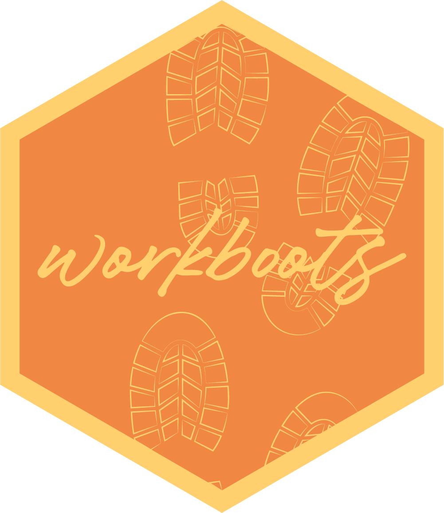

```{r setup, include=FALSE}
knitr::opts_chunk$set(
  echo = TRUE,
  comment = "#>",
  message = FALSE,
  warning = FALSE
)
```

# workboots 

**Author:** [Mark Rieke](https://www.thedatadiary.net/about/about/) <br/>
**License:** [MIT](https://github.com/markjrieke/workboots/blob/main/LICENSE)

<!-- badges: start -->
[](https://github.com/markjrieke/workboots/actions)
[](https://lifecycle.r-lib.org/articles/stages.html#experimental)
[](https://CRAN.R-project.org/package=workboots)
[](https://cran.r-project.org/package=workboots)
<!-- badges: end -->

## Overview

`{workboots}` is a tidy method of generating bootstrap prediction intervals for arbitrary model types from a tidymodel workflow. 

By using [bootstrap resampling](https://en.wikipedia.org/wiki/Bootstrapping_(statistics)), we can create many models --- one for each resample. Each model will be slightly different based on the resample it was trained on. Each model will also generate slightly different predictions for new data, allowing us to generate a prediction distribution for models that otherwise just return point predictions.

## Installation

You can install the released version of workboots from CRAN or the development version from github with the [devtools](https://cran.r-project.org/package=devtools) or [remotes](https://cran.r-project.org/package=remotes) package:

```{r, eval=FALSE}
# install from CRAN
install.packages("workboots")

# or the development version
devtools::install_github("markjrieke/workboots")
```

## Usage

workboots builds on top of the `{tidymodels}` suite of packages. Teaching how to use tidymodels is beyond the scope of this package, but some helpful resources are linked at the bottom of this README. 

To get started, we'll need to create a workflow.

```{r}
library(tidymodels)

# load our dataset
data("penguins")
penguins <- penguins %>% drop_na()

# split data into testing & training sets
set.seed(123)
penguins_split <- initial_split(penguins)
penguins_test <- testing(penguins_split)
penguins_train <- training(penguins_split)

# create a workflow
penguins_wf <- 
  workflow() %>%
  add_recipe(recipe(body_mass_g ~ ., data = penguins_train) %>% step_dummy(all_nominal())) %>%
  add_model(boost_tree("regression"))
```

Boosted tree models can only generate point predictions, but with workboots we can generate a prediction interval for each observation in `penguins_test` by passing the workflow to `predict_boots()`:

```{r, eval=FALSE}
library(workboots)

# generate predictions from 2000 bootstrap models
set.seed(345)
penguins_pred_int <-
  penguins_wf %>%
  predict_boots(
    n = 2000,
    training_data = penguins_train,
    new_data = penguins_test
  )

# summarise predictions with a 95% prediction interval
pengins_pred_int %>%
  summarise_predictions()
```

```{r,echo=FALSE}
library(workboots)

# load data from workboots_support (avoid re-fitting on knit)
penguins_pred_int <-readr::read_rds("https://github.com/markjrieke/workboots_support/blob/main/data/penguins_pred_int.rds?raw=true") 

penguins_pred_int %>%
  summarise_predictions()
```

Alternatively, we can generate a confidence interval around each prediction by setting the parameter `interval` to `"confidence"`:

```{r, eval=FALSE}
# generate predictions from 2000 bootstrap models
set.seed(456)
penguins_conf_int <- 
  penguins_wf %>%
  predict_boots(
    n = 2000,
    training_data = penguins_train,
    new_data = penguins_test,
    interval = "confidence"
  )

# summarise with a 95% confidence interval
penguins_conf_int %>%
  summarise_predictions()
```

```{r, echo=FALSE}
# load data from workboots_support (avoid re-fitting on knit)
penguins_conf_int <- readr::read_rds("https://github.com/markjrieke/workboots_support/blob/main/data/penguins_conf_int.rds?raw=true")

penguins_conf_int %>%
  summarise_predictions()
```

## Bug reports/feature requests 

If you notice a bug, want to request a new feature, or have recommendations on improving documentation, please [open an issue](https://github.com/markjrieke/workboots/issues) in this repository.

### Tidymodels Resources

* [Getting started with Tidymodels](https://www.tidymodels.org/start/)
* [Tidy Modeling with R](https://www.tmwr.org/)
* [Julia Silge's Blog](https://juliasilge.com/blog/) provides use cases of tidymodels with weekly [#tidytuesday](https://github.com/rfordatascience/tidytuesday) datasets. 

<p style="font-size:10pt; font-style:italic"> The hex logo for workboots was designed by <a style="white-space:nowrap" href="https://www.sarahpowerhouse.com/home">Sarah Power</a>.</p>
